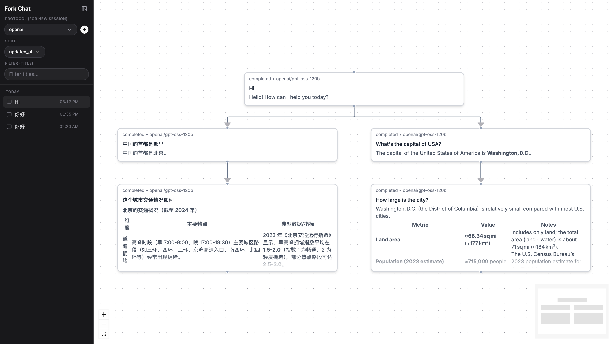

# ForkChat

A chat app where **every conversation is a tree**. Each turn is a node; you can fork from any node and explore a different branch. Each path from the root is an independent context sent to the LLM.



## Stack

| Layer    | Tech                                                                                       |
| -------- | ------------------------------------------------------------------------------------------ |
| Frontend | React 19 · Vite · TanStack Router · TanStack Query · shadcn · zustand · xyflow (tree view) |
| Backend  | Rust · Axum · sqlx · PostgreSQL · async-openai (Responses API)                             |
| Tooling  | pnpm · biome · bacon · sqlx-cli · just                                                     |

## Repository layout

```
fork-chat/
├── fork-chat-backend/   # Axum + Postgres service
│   ├── migrations/      # sqlx migrations
│   └── src/             # handlers, db, openai adapter, models
├── fork-chat-frontend/  # Vite + React app
│   └── src/             # pages, routes, components, store, api
├── CLAUDE.md            # agent guidance
└── PLAN.md              # design notes
```

## Prerequisites

- Node.js ≥ 20 and `pnpm`
- Rust (stable) and `cargo`
- PostgreSQL 14+ for local development, or Docker for `just db-up`
- `sqlx-cli` (`cargo install sqlx-cli --no-default-features --features postgres`)
- Docker for backend integration tests (`testcontainers`)
- Optional: [`just`](https://github.com/casey/just), [`bacon`](https://github.com/Canop/bacon), [`cargo-nextest`](https://nexte.st/)

## Setup

### 1. Backend

```bash
cd fork-chat-backend
cp .env.example .env          # then fill in OPENAI_API_KEY etc.
just db-up                    # optional: starts local Postgres via Docker
just reset-db                 # drops, recreates DB and runs migrations
cargo run                     # starts server on $SERVER_ADDR (default 0.0.0.0:3000)
```

Environment variables (see [.env.example](fork-chat-backend/.env.example)):

| Variable          | Purpose                                           |
| ----------------- | ------------------------------------------------- |
| `DATABASE_URL`    | Postgres connection string                        |
| `OPENAI_API_KEY`  | OpenAI-compatible API key (OpenAI, Groq, …)       |
| `OPENAI_BASE_URL` | Optional override (e.g. Groq, a proxy)            |
| `SERVER_ADDR`     | Bind address for Axum                             |
| `MODELS`          | Comma-separated model IDs exposed to the frontend |

### 2. Frontend

```bash
cd fork-chat-frontend
pnpm install
pnpm dev                      # http://localhost:5173
```

Other scripts: `pnpm build`, `pnpm typecheck`, `pnpm check` (biome lint + format), `pnpm check:fix`.

## Data model

Two tables (see [migrations/20260421150559_init.sql](fork-chat-backend/migrations/20260421150559_init.sql)):

- **`sessions`** — a conversation tree (id, title, system_prompt, metadata, timestamps).
- **`turns`** — a node in the tree. `parent_turn_id` defines the tree edge; `raw_items` stores the full OpenAI Responses-API output for that turn. Tracks status (`running`/`completed`/`failed`), tokens, model, and optional `retry_turn_id` for retries.

To continue a branch, the backend walks from the target turn up to the root, concatenates each turn's `raw_items`, appends the new user input, and sends the result to the model.

## API sketch

```
POST   /api/sessions                  create session + first turn
GET    /api/sessions                  list sessions
GET    /api/sessions/:id              session details
DELETE /api/sessions/:id              delete session

POST   /api/sessions/:id/turns        create turn (continue or fork)
GET    /api/sessions/:id/tree         full tree
GET    /api/sessions/:id/turns/:id    turn details
```

See [PLAN.md](PLAN.md) for the full design.

## Development notes

- **Backend tests:** `cargo test` runs the full backend suite. Integration tests use `testcontainers` to start isolated PostgreSQL containers, so Docker must be running. `just test` runs the same suite through `cargo nextest run`.
- **Frontend tests:** run `pnpm test:install` once to install Chromium for Vitest browser mode, then use `pnpm test:run`. Use `pnpm test:node` or `pnpm test:browser` to run one project.
- **Lint:** frontend uses Biome (`pnpm check:fix`); backend uses `cargo check` / `cargo clippy`.

## License

Not yet specified.
